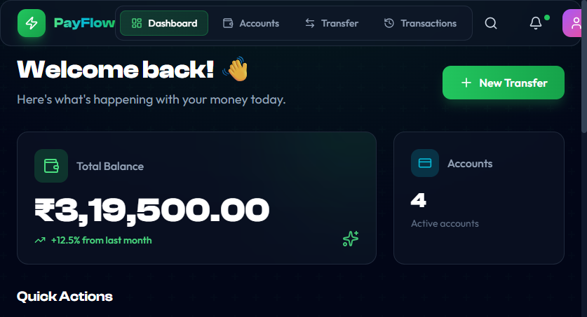
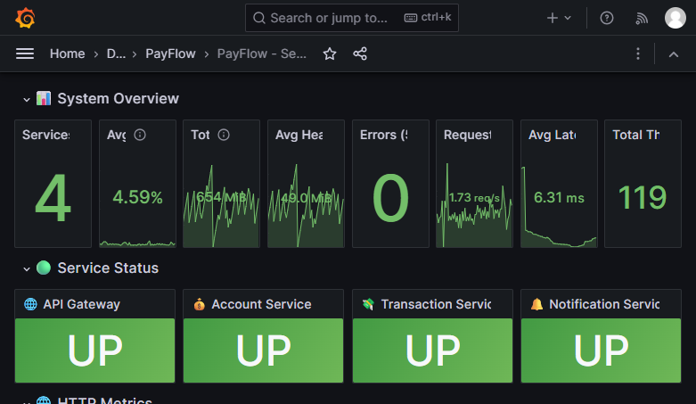

# 💰 PayFlow - Digital Wallet & Payment Platform

[](https://github.com/gaurav-barot/payflow/actions/workflows/ci-cd.yml)
[](https://opensource.org/licenses/MIT)

> Real-time Digital Wallet and Payment Platform built with Microservices Architecture, Kubernetes, and Event-Driven Design

## 🎬 Demo



**Live URL (Local):** `http://localhost:8000`

## 🏗️ Architecture

```
┌─────────────────────────────────────────────────────────────────────────────┐
│                         KUBERNETES CLUSTER (payflow namespace)               │
│                                                                              │
│  ┌──────────────────┐        ┌──────────────────┐                           │
│  │    Frontend      │        │   API GATEWAY    │                           │
│  │  (React + Nginx) │        │     :8080        │                           │
│  │      :80         │        │                  │                           │
│  │                  │  /api  │  ┌────────────┐  │                           │
│  │  ┌────────────┐  │───────►│  │  Routing   │  │                           │
│  │  │   Nginx    │  │        │  └─────┬──────┘  │                           │
│  │  │   Proxy    │  │        └────────┼─────────┘                           │
│  │  └────────────┘  │                 │                                     │
│  └──────────────────┘                 │                                     │
│                                       ▼                                     │
│              ┌────────────────────────┴────────────────────────┐            │
│              │                                                  │            │
│      ┌───────┴───────┐  ┌───────────────────┐  ┌──────────────┴───┐        │
│      │    Account    │  │   Transaction     │  │   Notification   │        │
│      │    Service    │  │     Service       │  │     Service      │        │
│      │     :8081     │  │      :8082        │  │      :8083       │        │
│      └───────┬───────┘  └─────────┬─────────┘  └──────────────────┘        │
│              │                    │                     ▲                   │
│              │                    │                     │                   │
│              ▼                    ▼                     │                   │
│      ┌───────────────────────────────────────┐         │                   │
│      │              POSTGRESQL               │         │                   │
│      │              (Database)               │         │                   │
│      └───────────────────────────────────────┘         │                   │
│                                                        │                   │
│      ┌─────────────────────────────────────────────────┴───────────────┐   │
│      │                         KAFKA                                    │   │
│      │                (Event-Driven Messaging)                          │   │
│      │  Topics: transaction-initiated, debit-completed, credit-completed│   │
│      └──────────────────────────────────────────────────────────────────┘   │
│                                                                              │
│      ┌──────────────────────────────────────────────────────────────────┐   │
│      │                      MONITORING STACK                             │   │
│      │  ┌─────────────┐     ┌─────────────┐                             │   │
│      │  │ Prometheus  │────►│   Grafana   │                             │   │
│      │  │   :9090     │     │   :3000     │                             │   │
│      │  └─────────────┘     └─────────────┘                             │   │
│      └──────────────────────────────────────────────────────────────────┘   │
│                                                                              │
└──────────────────────────────────────────────────────────────────────────────┘

Request Flow:
  Browser → Nginx (/api/*) → API Gateway → Account/Transaction Service
```

## 🛠️ Technology Stack

| Layer | Technology |
|-------|------------|
| **Backend** | Java 21, Spring Boot 3.2, Spring Cloud Gateway |
| **Database** | PostgreSQL 15 |
| **Messaging** | Apache Kafka 3.7 (KRaft mode) |
| **Frontend** | React 18, Vite, Tailwind CSS, Framer Motion |
| **Web Server** | Nginx (Reverse Proxy for API) |
| **Container** | Docker |
| **Orchestration** | Kubernetes (Docker Desktop / K3s) |
| **CI/CD** | GitHub Actions with selective builds |
| **Registry** | GitHub Container Registry (GHCR) |
| **Monitoring** | Prometheus + Grafana |

## 📊 Monitoring Dashboard

The PayFlow platform includes a comprehensive **Grafana dashboard** for real-time monitoring:



### Dashboard Sections

| Section | Metrics | Purpose |
|---------|---------|---------|
| **System Overview** | Services Up, CPU %, RAM, Errors, Latency, Threads | Quick health check |
| **Service Status** | UP/DOWN for each service | Individual service health |
| **HTTP Metrics** | Request Rate, Response Time | API performance |
| **Kafka Messaging** | Producer/Consumer Rate, Consumer Lag | Message queue health |
| **Database Pool** | Active/Idle Connections, Pending, Acquire Time | HikariCP connection pool |
| **JVM Metrics** | Heap Memory, Threads, GC Pause | Java runtime health |

### Key Metrics Explained

| Metric | Healthy Value | What It Means |
|--------|--------------|---------------|
| **Services Up** | 4 | All 4 Spring Boot services running |
| **Avg CPU** | < 50% | System not overloaded |
| **Errors (5m)** | 0 | No exceptions in last 5 minutes |
| **Avg Latency** | < 100ms | Fast response times |
| **Kafka Lag** | 0 | Messages processed immediately |
| **DB Pending** | 0 | No threads waiting for DB connection |

### Access Monitoring

```powershell
# Start Grafana port-forward
kubectl port-forward svc/grafana 30000:3000 -n payflow

# Open http://localhost:30000
# Login: admin / payflow123
```

## 📁 Project Structure

```
payflow/
├── services/
│   ├── api-gateway/          # Spring Cloud Gateway (Port 8080)
│   ├── account-service/      # Account Management (Port 8081)
│   ├── transaction-service/  # Transaction Processing (Port 8082)
│   └── notification-service/ # Kafka Event Consumer (Port 8083)
├── frontend/                 # React + Vite + Tailwind
│   ├── src/
│   │   ├── pages/           # Dashboard, Accounts, Transfer, Transactions
│   │   ├── components/      # Reusable UI components
│   │   └── api/             # API client configuration
│   ├── nginx.conf           # Nginx config with API proxy rules
│   └── Dockerfile           # Multi-stage build with Nginx
├── k8s/                      # Kubernetes Manifests
│   ├── namespace.yaml
│   ├── deployments/         # All service deployments
│   ├── services/            # ClusterIP services
│   ├── configmaps/          # Configuration
│   ├── secrets/             # Sensitive data
│   └── monitoring/          # Prometheus & Grafana
│       ├── prometheus-*.yaml
│       └── grafana-*.yaml
├── .github/workflows/       # CI/CD Pipeline
│   └── ci-cd.yml            # Selective build & deploy
├── docs/images/             # Screenshots and documentation images
└── deploy-k8s.ps1           # Local deployment script
```

## 🔀 Nginx Reverse Proxy

One of the key architectural decisions in this project is using **Nginx as a reverse proxy** inside the frontend container. This solves a critical problem in Kubernetes: **how does a browser-based React app communicate with backend services?**

### The Problem

In Kubernetes, services communicate using internal DNS names (e.g., `api-gateway:8080`). But React apps run in the **browser**, not inside the cluster - so they can't resolve these internal service names.

### The Solution: Nginx Proxy

The frontend container runs Nginx which:
1. **Serves the React static files** (HTML, JS, CSS)
2. **Proxies API requests** to backend services

```nginx
# frontend/nginx.conf
server {
    listen 80;
    
    # API requests → proxy to API Gateway (internal K8s service)
    location /api/ {
        proxy_pass http://api-gateway:8080/api/;
        proxy_http_version 1.1;
        proxy_set_header Host $host;
        proxy_set_header X-Real-IP $remote_addr;
        proxy_set_header X-Forwarded-For $proxy_add_x_forwarded_for;
    }
    
    # All other requests → serve React app
    location / {
        root /usr/share/nginx/html;
        try_files $uri $uri/ /index.html;  # SPA routing
    }
}
```

### How It Works

```
Browser (localhost:8000)
    │
    ├── GET /dashboard → Nginx serves React app (index.html)
    │
    └── GET /api/accounts → Nginx proxies to api-gateway:8080
                                     │
                                     └── API Gateway routes to account-service:8081
```

### Benefits

| Benefit | Description |
|---------|-------------|
| **Single Entry Point** | Browser only needs to know one URL |
| **No CORS Issues** | Same-origin requests (API on same domain) |
| **Security** | Backend services never exposed directly |
| **K8s Native** | Uses internal service discovery |

## 🚀 Quick Start

### Prerequisites

- Docker Desktop with Kubernetes enabled
- Java 21
- Maven 3.8+
- Node.js 20+
- kubectl

### Option 1: Local Kubernetes (Recommended)

```powershell
# Clone the repository
git clone https://github.com/gaurav-barot/payflow.git
cd payflow

# Deploy to Kubernetes
./deploy-k8s.ps1 -Environment dev

# Start port-forwarding
kubectl port-forward svc/frontend 8000:80 -n payflow

# Open http://localhost:8000
```

### Option 2: Docker Compose

```bash
docker-compose up -d
# Open http://localhost:3000
```

### Access Monitoring

```powershell
# Grafana Dashboard
kubectl port-forward svc/grafana 30000:3000 -n payflow
# Open http://localhost:30000 (admin/payflow123)

# Prometheus (Direct)
kubectl port-forward svc/prometheus 9090:9090 -n payflow
# Open http://localhost:9090
```

## 🔄 CI/CD Pipeline

Our pipeline features **selective builds** - only changed services are built and deployed:

```
┌──────────────┐   ┌──────────────┐   ┌──────────────┐   ┌──────────────┐
│   DETECT     │──►│    BUILD     │──►│    PUSH      │──►│   DEPLOY     │
│   CHANGES    │   │ (only changed)│   │  to GHCR    │   │  Summary     │
└──────────────┘   └──────────────┘   └──────────────┘   └──────────────┘
```

| Branch | Image Tag | Action |
|--------|-----------|--------|
| `develop` | `:develop` | Build → Push → Show deploy commands |
| `main` | `:latest` | Build → Push → Show deploy commands |

### After Push:

The pipeline summary shows exact commands to run:

```powershell
# Restart updated services
kubectl rollout restart deployment/frontend -n payflow
kubectl rollout restart deployment/account-service -n payflow

# Verify
kubectl get pods -n payflow
```

## 📨 API Endpoints

All API requests go through `http://localhost:8000/api/` (proxied by Nginx)

### Account Service

| Method | Endpoint | Description |
|--------|----------|-------------|
| POST | `/api/accounts` | Create account |
| GET | `/api/accounts` | List all accounts |
| GET | `/api/accounts/{id}` | Get account by ID |
| GET | `/api/accounts/number/{num}` | Get by account number |

### Transaction Service

| Method | Endpoint | Description |
|--------|----------|-------------|
| POST | `/api/transactions` | Initiate transfer |
| GET | `/api/transactions` | List all transactions |
| GET | `/api/transactions/{id}` | Get transaction by ID |
| GET | `/api/transactions/account/{num}` | Get by account number |

## 🔧 Key Features

- ✅ **Microservices Architecture** - 5 independent services
- ✅ **Event-Driven** - Kafka for async communication
- ✅ **Nginx Reverse Proxy** - Clean API routing from frontend
- ✅ **Kubernetes Native** - Full k8s deployment manifests
- ✅ **Selective CI/CD** - Only builds changed services
- ✅ **Modern React UI** - Tailwind CSS, Framer Motion animations
- ✅ **API Gateway** - Spring Cloud Gateway routing
- ✅ **Health Checks** - Kubernetes probes configured
- ✅ **GitOps Ready** - GHCR images, k8s manifests
- ✅ **Prometheus Monitoring** - Metrics collection from all services
- ✅ **Grafana Dashboard** - Real-time visualization

## 🖥️ Local Development

### Quick Restart (After Pipeline Push)

```powershell
# Pull latest changes
git pull origin develop

# Restart only changed services
./deploy-k8s.ps1 -RolloutOnly
```

### Full Redeploy

```powershell
./deploy-k8s.ps1 -Environment dev
```

### Skip Infrastructure

```powershell
./deploy-k8s.ps1 -Environment dev -SkipInfra
```

## 📊 Upcoming Features

- [ ] User authentication (JWT)
- [ ] Transaction notifications (email/SMS)
- [ ] QR code payments
- [ ] AWS Production deployment
- [ ] Kubernetes Horizontal Pod Autoscaler

## 👥 Author

**Gaurav Barot** - [GitHub](https://github.com/gaurav-barot)

## 📄 License

This project is licensed under the MIT License - see the [LICENSE](LICENSE) file for details.

---

*Built with ❤️ using Spring Boot, React, Kubernetes, Kafka, Prometheus, Grafana, and Nginx*
